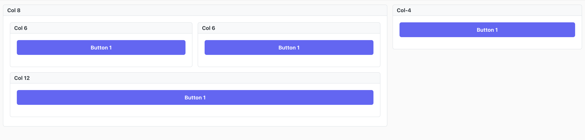

# Ancleto UI
In Anacleto each window is represented by a json object. This object contains all the info needed to render the entire window.

Below is an example

```json
{
  "id": "home",
  "windowName": "Home",
  "component": "GridContainer",
  "items": [
    {
      "id": "home_sample_form",
      "component": "Form",
      "isCard": true,
      "toggleable": false,
      "title": "Welcome form",
      "containerClassName": "col-12 md:col-6",
      "className": "mt-0 md:mt-4",
      "items": [
        {
          "component": "Label",
          "className": "col-12 font-bold text-3xl",
          "id": "title",
          "label": "ANACLETO_SAMPLE"
        },
        {
          "component": "Label",
          "className": "col-12 mt-3",
          "id": "subtitle",
          "label": "Thank you for installing Anacleto Builder! 🦉"
        },
        {
          "component": "Label",
          "className": "col-12 mt-3",
          "id": "subtitle-2",
          "label": "This is an example window created using Anacleto, use the Builder to customize it and start building your application."
        },
        {
          "component": "Button",
          "containerClassName": "col-auto mt-5",
          "className": "col-12 md:col-6",
          "id": "btnBuilder",
          "label": "Go to Builder 👷‍♂️",
          "events": {
            "onClick": {
              "body": "window.open('/admin', '_blank').focus();"
            }
          }
        },
        {
          "component": "Label",
          "className": "col-12 mt-5",
          "id": "subtitle-3",
          "label": "If you have any questions check out the Docs or contact us on GitHub. 🧐"
        },
        {
          "component": "Button",
          "containerClassName": "col-12 md:col-6 mt-5",
          "className": "col-12",
          "id": "btnDocs",
          "label": "Docs 📖",
          "events": {
            "onClick": {
              "body": "window.open('https://github.com/anacletobuilder/anacleto.wiki.git', '_blank').focus();"
            }
          }
        },
        {
          "component": "Button",
          "containerClassName": "col-12 md:col-6 mt-5",
          "className": "col-12",
          "id": "btnGit",
          "label": "GitHub 🗂",
          "events": {
            "onClick": {
              "body": "window.open('https://github.com/anacletobuilder/anacleto', '_blank').focus();"
            }
          }
        }
      ]
    },
    {
      "id": "home_sample_grid",
      "component": "DataTable",
      "store": "sample_store",
      "emptyMessage": "No owls",
      "isCard": true,
      "toggleable": false,
      "title": "Owls",
      "containerClassName": "col-12 md:col-6",
      "className": "mt-0 md:mt-4",
      "sortable": true,
      "stripedRows": true,
      "skeletonRow": 5,
      "paginator": true,
      "paginationType": "client",
      "globalFilterMode": "client",
      "globalFilterFields": ["name", "scientificName", "type"],
      "columns": [
        {
          "field": "name",
          "header": "Name",
          "sortable": true
        },
        {
          "field": "scientificName",
          "header": "Scientific Name",
          "sortable": true
        },
        {
          "field": "type",
          "header": "Owl type",
          "sortable": true,
          "pugTemplate": "return `div.flex.flex-row\n\tspan.flex-shrink-0.p-tag.surface-300\n\t\tspan.text-600.flex-shrink-0 ${data['type']}`;"
        },
        {
          "field": "dangerOfExtinction",
          "header": "Danger of extinction",
          "sortable": true,
          "pugTemplate": "let emoj = '😊';\nif(data['dangerOfExtinction']===1){emoj='😨'}\nif(data['dangerOfExtinction']===2){emoj='😱'}\nreturn `span ${emoj}`"
        }
      ],
      "events": {
        "onSelectionChange": {
          "parameters": "event",
          "body": "if(event.value){ alert(`${event.value.name} is so cute!`) } ;"
        },
        "afterRender": {
          "body": "this.load();"
        }
      }
    }
  ]
}
```

It is essential for each item to specify the `id` attribute, this will allow us to interact with the control via Javascript.

For example, suppose we want to change the label of the `title` input field inside the `home_sample_form` panel, what we need to do is:

```javascript
context.panels.home_sample_form.items.title.label = `My title Edit`;
```

> NB: the id of an item is NOT the id of the html tag

## Avoid javascript

**NEVER USE JS FUNCTIONS such as: document.getElementById or document. querySelector TO MODIFY A WINDOW.**

Anacleto was developed in React and to use its full potential we must forget the existence of these methods, in React every graphic control is linked to states and to modify it you have to act on these states.

## Layout
When creating a window you can choose between 2 types of layouts, using the `layout` property
* grid
* flex

If no property is specified, the default `grid` will be used.

In addition to the layout you can add additional classes to the window or components using the `classNames` attribute

## grid layout
```json
"layout" : "grid"
```
When using the grid layout Anacleto is completely autonomous in arranging the panels within a window, the only thing you need to do is give the panels a weight **from 1 to 12**.

> If a weight is not specified by default the value is 12.

The weight of a panel must be specified through the `className` property using the appropriate classes` col-1`, `col-2` ...` col-12`.

If you decide to use `col` without specifying a weight, the columns will be evenly distributed.

If you want to give a column a specific dimension use `col-fixed` and specify the desired dimension in the style.

If you need it you can define a different weight for different screens, to do this use the prefixes:
- sm
- md
- lg
- xl

Immagina lo schermo diviso in 12 colonne, nell'esempio di seguito la larghezza del pannello sarà di default 12 (l'intera larghezza dello schermo).
Negli schermi di medie dimensioni il pannello occuperà 8 colonne (2/3 dello schermo), mentre degli schermi grandi (o molto grandi) grandi il pannello occuperà 6 colonne di 12 (ossia metà schermo).
```json
"colNumber" : "col-12 md:col-8 lg:col-6"
```

>**TIPS:**  Questa tecnica delle 12 colonne è largamente utilizzata da molti anni per creare applicazioni responsive. Se sei curioso indaga un po' nel web

In aggiunta alla proprietà `colNumber` puoi utilizzare `classNames` per aggiungere al tuo pannello le classi che più desideri separata da spazio.

le classi `col-offset-1`..`col-offset-12` ti permettono di definire il margine sinistro, utile se vuoi aggiungere spazi o centrare un pannello.

>**TIPS:** Puoi combinare più layout grid per creare layout più complessi, di seguito un esempio.

```json
{
    "window": "home",
    "layout":"grid",
    "items": [

        {
            "id": "panel_0",
            "type": "gridcontainer",
            "colNumber" : "col-8",
            "title": "Col 8",
            "classNames": "",
            "isCard": true,
            "items": [
                {
                    "id": "panel_1",
                    "type": "form",
                    "colNumber" : "col-6",
                    "title": "Col 6",
                    "classNames": "",
                    "isCard": true,
                    "items": [
                        {
                            "id": "button1",
                            "type": "button",
                            "colNumber" : "col-12",
                            "width": "w-full",
                            "label": "Button 1",
                        }
                    ]
                },
                {
                    "id": "panel_2",
                    "type": "form",
                    "colNumber" : "col-6",
                    "title": "Col 6",
                    "classNames": "",
                    "isCard": true,
                    "items": [
                        {
                            "id": "button1",
                            "type": "button",
                            "colNumber" : "col-12",
                            "width": "w-full",
                            "label": "Button 1",
                        }
                    ]
                },
                {
                    "id": "panel_3",
                    "type": "form",
                    "colNumber" : "col-12",
                    "title": "Col 12",
                    "classNames": "",
                    "isCard": true,
                    "items": [
                        {
                            "id": "button1",
                            "type": "button",
                            "colNumber" : "col-12",
                            "width": "w-full",
                            "label": "Button 1",
                        }
                    ]
                }
            ]
        },
        {
            "id": "panel-4",
            "type": "form",
            "title": "Col-4",
            "colNumber" : "col-4",
            "classNames": "",
            "isCard": true,
            "items": [
                {
                    "id": "button1",
                    "type": "button",
                    "colNumber" : "col-12",
                    "width": "w-full",
                    "label": "Button 1",
                }
            ]
        }
    ]
}
```




## flex system
```json
"layout" : "flex"
```
Flex, flex e ancora flex...se non sa di cosa stiamo parlando documentati qui:
- [Docs](https://css-tricks.com/snippets/css/a-guide-to-flexbox/) 
- [Video](https://www.youtube.com/watch?v=IDDK6sX003Q)
- [Video esempio 2](https://www.youtube.com/watch?v=M1yD8GVpLnQ)

Se vuoi essere libero di disegnare una finestra a tuo piacimaneto imposta l'attributo della finestra `layout=flex`, da questo momento in poi sarai libero di posizionare i pannelli come desideri utilizzando la proprietà `classNames`

Quando utilizzi il layout `flex` Anacleto di mette a disposizione alcune classi che possono aiutarti nel posizionare un pannello

- `flex-row` imposta `flex-direction: row;`
- `flex-row-reverse` imposta `flex-direction: row-reverse;`
- `flex-column` imposta `flex-direction: column;`
- `flex-column-reverse`imposta `flex-direction: column-reverse;`

- `flex-wrap` imposta `flex-wrap: wrap;`
- `flex-wrap-reverse` imposta `flex-wrap: wrap-reverse;`
- `flex-nowrap` imposta `flex-wrap: nowrap;`

- `flex-auto` imposta `flex: 1 1 auto;`
- `flex-1` imposta `flex: 1 1 0% !important;` utile quando vuoi dare peso 1 a un pannello (se metti 3 pannelli con flex 1 saranno tutti e 3 larghi uguali)
- `flex-2` imposta `flex: 2 2 0% !important;` utile quando vuoi dare peso 2 a un pannello (sarà sempre largo il doppio di un pannello con flex 1)
- `flex-grow-0`	imposta `flex-grow: 0;`
- `flex-grow-1`	imposta `flex-grow: 1`
- `flex-shrink-0` imposta `flex-shrink: 0;`
- `flex-shrink-1`imposta `flex-shrink: 1;`
- `stretch` il pannello occuperà tutto lo schermo in altezza

>**TIPS:** tutte queste classi supportano sm, md, lg, xl usali per creare applicazioni responsive come si deve


### gap
Nel responsive NON si usano margini e padding, usa il gap, di seguito alcune classi di utilità già pronte
- `gap-0` imposta `gap: 0;`
- `gap-1` imposta `gap: 0.25rem;`
- `gap-2` imposta `gap: 0.5rem;`
- `gap-3` imposta `gap: 1rem;`
- `gap-4` imposta `gap: 1.5rem;`
- `gap-5` imposta `gap: 2rem;`
- `gap-6` imposta `gap: 3rem;`
- `gap-7` imposta `gap: 4rem;`
- `gap-8` imposta `gap: 5rem;`
- `row-gap-0` imposta `row-gap: 0;`
- `row-gap-1` imposta `row-gap: 0.25rem;`
- `row-gap-2` imposta `row-gap: 0.5rem;`
- `row-gap-3` imposta `row-gap: 1rem;`
- `row-gap-4` imposta `row-gap: 1.5rem;`
- `row-gap-5` imposta `row-gap: 2rem;`
- `row-gap-6` imposta `row-gap: 3rem;`
- `row-gap-7` imposta `row-gap: 4rem;`
- `row-gap-8` imposta `row-gap: 5rem;`
- `column-gap-0` imposta `column-gap: 0;`
- `column-gap-1` imposta `column-gap: 0.25rem;`
- `column-gap-2` imposta `column-gap: 0.5rem;`
- `column-gap-3` imposta `column-gap: 1rem;`
- `column-gap-4` imposta `column-gap: 1.5rem;`
- `column-gap-5` imposta `column-gap: 2rem;`
- `column-gap-6` imposta `column-gap: 3rem;`
- `column-gap-7` imposta `column-gap: 4rem;`
- `column-gap-8` imposta `column-gap: 5rem;`

### Prime flex
A questo link puoi trovare molte altre classi che ti possono essere utili [DOCS](https://www.primefaces.org/primeflex/flexdirection)

## style
Per ogni pannello (o controllo) puoi usare la proprietà `style` per definire degli style in-line. Usala con cautela, in generale è sempre meglio definire una classe!

Es:
```json
style: {
    "gap": "1rem"
}
```

# Translations
Anacleto allows you to translate your application and will use the browser language to show the correct translation.

[Docs](translation.md)

# Pannelli
In una finestra di Anacleto puoi inserire diversi tipi di pannello.

Ogni tipo di pannello estende il [Pannello](ui_panel.md) e ne eredita i metodi e le proprietà.

Di seguito i tipi di pannello disponibili:
- [Grid Container](ui_gridcontainer.md)
- [TabView](ui_tabview.md)
- [Form](ui_form.md)
- [Table](ui_table.md)
- [Tree](ui_tree.md)
